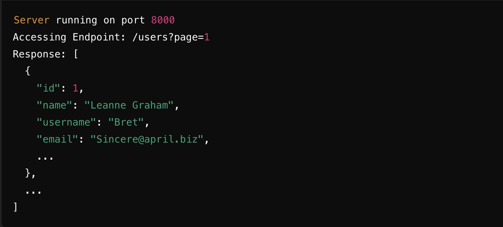

# delta-sdk

## Description
This project was created using `bun init` in bun v1.1.26. [Bun](https://bun.sh) is a fast all-in-one JavaScript runtime.

## Installation

To install dependencies :

```bash
git clone https://github.com/ivandi1980/delta-sdk.git
```

To install dependencies :

```bash
bun install
```

To run the project :

```bash
bun run --watch dev
```

## Available Endpoints

<details>
  <summary>Get Users</summary>

-  <kbd>URL: http://localhost:8000/users</kbd>
-  <kbd>Method: GET</kbd>
-  <kbd>Query Parameter:</kbd>
- <kbd>page: (optional) The page number of the users you want to retrieve.</kbd>
- <kbd>Example Request:</kbd>
```bash
curl -X GET "http://localhost:8000/users?page=1" -H  "accept: application/json"
```
- <kbd>Example Response:</kbd>
```json
{
  "data": [
    {
      "id": 3,
      "name": "Clementine Bauch",
      "username": "Samantha",
      "email": "Nathan@yesenia.net",
      "address": {
        "street": "Douglas Extension",
        "suite": "Suite 847",
        "city": "McMacKenziehaven",
        "zipcode": "59590-4157",
        "geo": {
          "lat": "-68.6102",
          "lng": "-47.0653"
        }
      },
      "phone": "1-463-123-4447",
      "website": "ramiro.info",
      "company": {
        "name": "Romaguera-Jacobson",
        "catchPhrase": "Face to face bifurcated interface",
        "bs": "e-enable strategic applications"
      }
    },
    {
      "id": 4,
      "name": "Patricia Lebsack",
      "username": "Karianne",
      "email": "Julianne.OConner@kory.org",
      "address": {
        "street": "Holger Mall",
        "suite": "Apt. 692",
        "city": "South Elvis",
        "zipcode": "53919-4257",
        "geo": {
          "lat": "29.4572",
          "lng": "-164.2990"
        }
      },
      "phone": "493-170-9623 x156",
      "website": "kale.biz",
      "company": {
        "name": "Rebel-Corker",
        "catchPhrase": "Multi-tiered zero tolerance productivity",
        "bs": "transition cutting-edge web services"
      }
    }
  ]
}
```

</details>

<details>
  <summary>Get Posts</summary>

-  <kbd>URL: http://localhost:8000/posts</kbd>
-  <kbd>Method: GET</kbd>
-  <kbd>Query Parameter:</kbd>
- <kbd>page: (optional) The page number of the users you want to retrieve.</kbd>
- <kbd>Example Request:</kbd>
```bash
curl -X GET "http://localhost:8000/posts?page=1" -H  "accept: application/json"
```
- <kbd>Example Response:</kbd>
```json
{
  "data": [
    {
      "userId": 1,
      "id": 1,
      "title": "sunt aut facere repellat provident occaecati excepturi optio reprehenderit",
      "body": "quia et suscipit\nsuscipit recusandae consequuntur expedita et cum\nreprehenderit molestiae ut ut quas totam\nnostrum rerum est autem sunt rem eveniet architecto"
    },
    {
      "userId": 1,
      "id": 2,
      "title": "qui est esse",
      "body": "est rerum tempore vitae\nsequi sint nihil reprehenderit dolor beatae ea dolores neque\nfugiat blanditiis voluptate porro vel nihil molestiae ut reiciendis\nqui aperiam non debitis possimus qui neque nisi nulla"
    }
  ]
}
```

</details>

<details>
  <summary>Get Comments</summary>

-  <kbd>URL: http://localhost:8000/comments</kbd>
-  <kbd>Method: GET</kbd>
-  <kbd>Query Parameter:</kbd>
- <kbd>page: (optional) The page number of the users you want to retrieve.</kbd>
- <kbd>Example Request:</kbd>
```bash
curl -X GET "http://localhost:8000/comments?page=1" -H  "accept: application/json"
```
- <kbd>Example Response:</kbd>
```json
{
  "data": [
    {
      "postId": 1,
      "id": 1,
      "name": "id labore ex et quam laborum",
      "email": "Eliseo@gardner.biz",
      "body": "laudantium enim quasi est quidem magnam voluptate ipsam eos\ntempora quo necessitatibus\ndolor quam autem quasi\nreiciendis et nam sapiente accusantium"
    },
    {
      "postId": 1,
      "id": 2,
      "name": "quo vero reiciendis velit similique earum",
      "email": "Jayne_Kuhic@sydney.com",
      "body": "est natus enim nihil est dolore omnis voluptatem numquam\net omnis occaecati quod ullam at\nvoluptatem error expedita pariatur\nnihil sint nostrum voluptatem reiciendis et"
    }
  ]
}
```

</details>


## Screenshots

Here is a unit test screenshot of the project:

- Unit Test Screenshot


- Console Screenshot


## Credits
[ivandjoh](https://github.com/ivandi1980)
