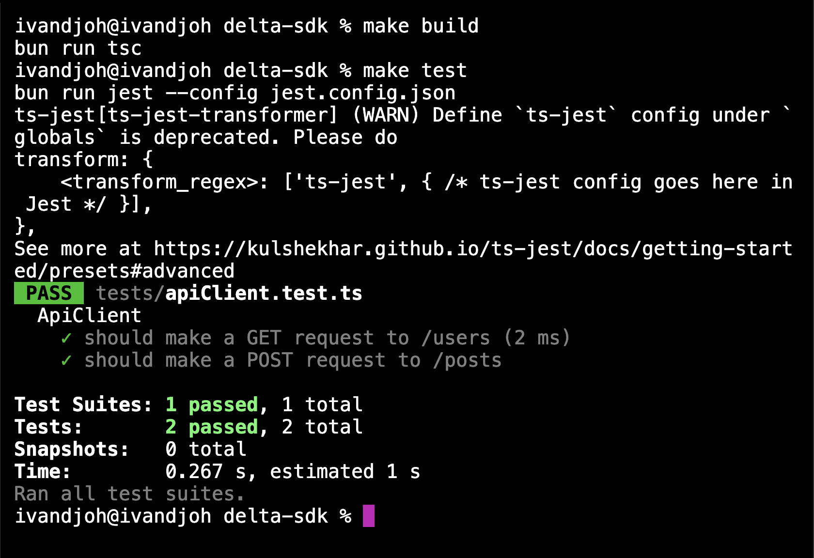

# delta-sdk

## Description
This project was created using `bun init` in bun v1.1.26. [Bun](https://bun.sh) is a fast all-in-one JavaScript runtime.

## Installation

To install dependencies :

```bash
git clone https://github.com/ivandi1980/delta-sdk.git
```

To install dependencies :

```bash
bun install
```

To run the project :

```bash
bun run --watch dev
```

## Screenshots

Here is a unit test screenshot of the project:




## Credits
[ivandjoh](https://github.com/ivandi1980)
